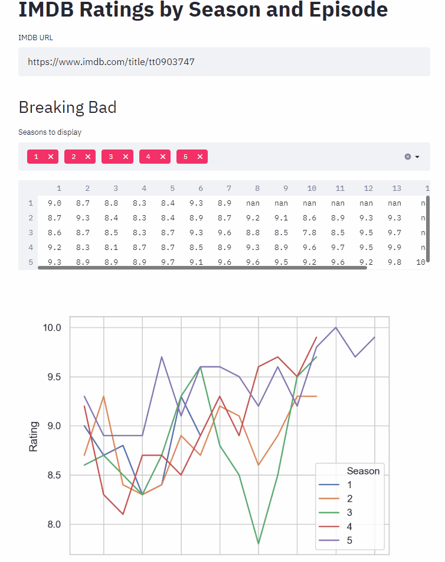

# IMDB Ratings App
Quick project to test out [streamlit](https://streamlit.io/). The app scrapes IMDB for episode ratings and display the ratings in a heatmap, line plot, and tabular format with a multi-select to filter out specific seasons.

## Usage
    streamlit run imdb_ratings\ratings_app.py

## Demo
Demo showing how to hide a season with the multi-select, changing the displayed television show by inputting a new IMDB URL, and scrolling to see the other available plots/tables.

## To-do
* Sanitize user URL inputs
* Switch from pickles to JSON for caching